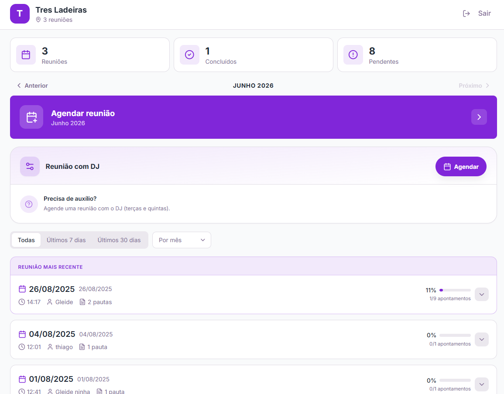
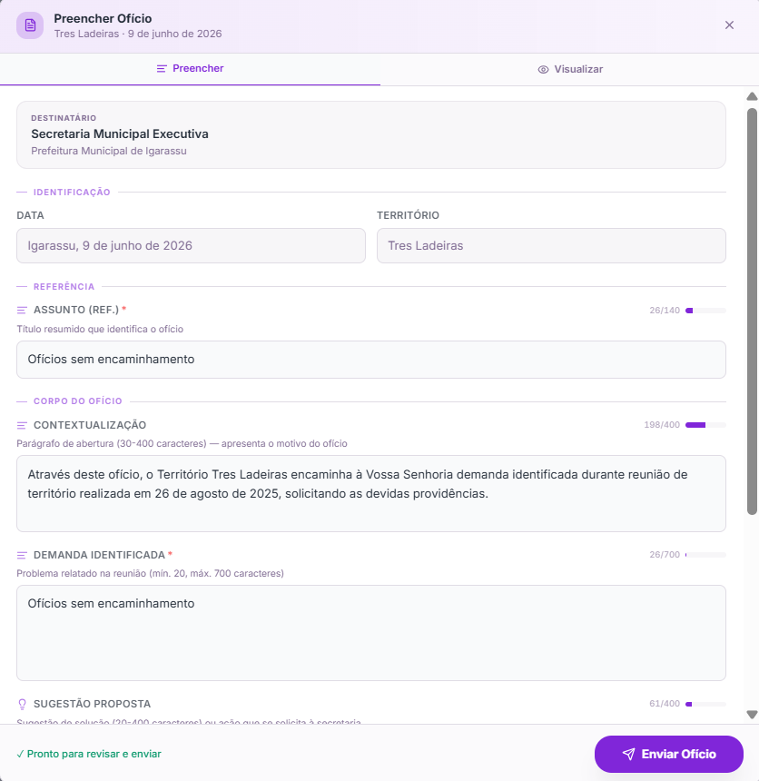
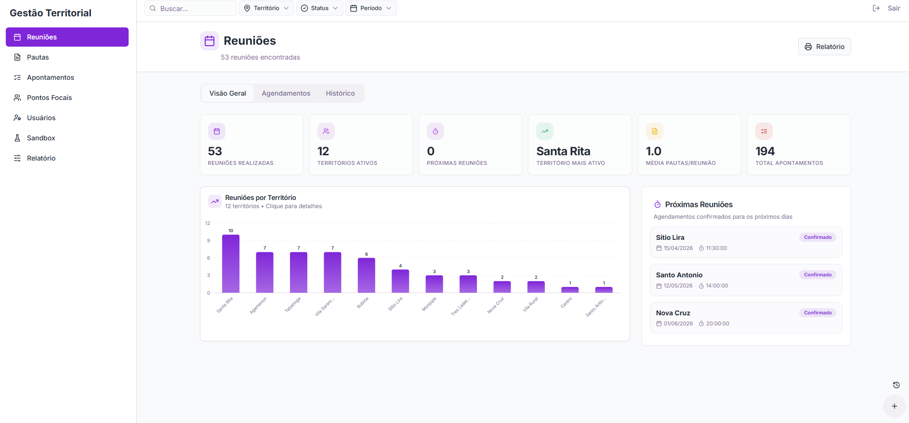

# Sistema de Gestão Territorial

## Visão Geral

O Sistema de Gestão Territorial é uma plataforma web desenvolvida para centralizar o registro, acompanhamento e encaminhamento de demandas provenientes de reuniões territoriais.

A solução foi criada para atender 12 territórios independentes, cada um com acesso restrito às suas próprias informações, permitindo o registro estruturado de reuniões, pautas, apontamentos e ofícios. Além do uso pelos pontos focais dos territórios, o sistema também oferece funcionalidades específicas para equipes de gestão e acompanhamento institucional.

O principal objetivo da plataforma é transformar processos anteriormente dispersos em um fluxo único e rastreável, gerando registros confiáveis, histórico de decisões e informações consolidadas para apoio à tomada de decisão.

A plataforma integra o fluxo de trabalho utilizado pelos territórios e pelas equipes responsáveis pelo acompanhamento das demandas, concentrando informações que anteriormente eram registradas e acompanhadas de forma descentralizada.

## Principais Funcionalidades

### Módulo Territorial

O módulo territorial concentra as funcionalidades utilizadas pelos pontos focais responsáveis pelo acompanhamento das demandas de cada território.

A partir deste ambiente, os usuários podem agendar reuniões, registrar sua realização, cadastrar participantes, estruturar pautas e acompanhar os apontamentos gerados ao longo do tempo.

Para reduzir retrabalho e garantir continuidade no acompanhamento das demandas, o sistema reaproveita automaticamente participantes da reunião anterior e mantém ativos os apontamentos com status "Pendente" e "Em Andamento" até sua conclusão.

Os apontamentos registrados podem ser convertidos diretamente em ofícios, utilizando informações já preenchidas durante a reunião para agilizar a formalização e o encaminhamento das solicitações.

Após a autenticação, cada território possui acesso apenas às suas próprias informações, garantindo isolamento dos dados e independência operacional entre os diferentes grupos atendidos pela plataforma.

### Módulo Institucional

O módulo institucional é utilizado pelas equipes responsáveis pela análise e encaminhamento das demandas geradas pelos territórios.

Por meio deste ambiente, os usuários recebem os ofícios emitidos pelos pontos focais, analisam as solicitações registradas e direcionam cada demanda para a secretaria ou órgão responsável pelo atendimento.

O módulo também permite acompanhar a tramitação dos ofícios, atualizar seus status e registrar a evolução das demandas ao longo do processo de atendimento.

As atualizações realizadas neste ambiente são refletidas automaticamente para os territórios de origem, permitindo que os responsáveis acompanhem o andamento de suas solicitações sem a necessidade de comunicação paralela ou controles externos.

### Módulo Administrativo

O módulo administrativo oferece uma visão consolidada das informações registradas em toda a plataforma, apoiando atividades de acompanhamento, monitoramento e tomada de decisão.

Por meio deste ambiente, é possível analisar indicadores relacionados a reuniões, pautas, apontamentos e ofícios, utilizando filtros por período, território e diferentes níveis de detalhamento.

Além da visualização dos dados em dashboards, o sistema permite a geração de relatórios em formato PDF voltados para uso institucional e acompanhamento gerencial.

O módulo também incorpora recursos de acessibilidade, incluindo ajustes de tamanho de fonte para atender diferentes perfis de usuários e facilitar a consulta das informações.

## Tecnologias Utilizadas

### Front-end

* React
* TypeScript
* Vite
* React Router

### Interface e Experiência do Usuário

* Tailwind CSS
* Shadcn/UI
* Radix UI
* Lucide Icons

### Gerenciamento de Estado e Dados

* React Query

### Formulários e Validação

* React Hook Form
* Zod

### Banco de Dados e Backend

* Supabase
* PostgreSQL

### Relatórios e Visualização de Dados

* Recharts
* PDFMake

### Hospedagem e Deploy

* Vercel

## Resultados e Impacto

O Sistema de Gestão Territorial foi desenvolvido para apoiar o acompanhamento das demandas dos territórios e atualmente integra o fluxo de trabalho utilizado pelas equipes responsáveis pelo registro, encaminhamento e monitoramento das solicitações.

A plataforma centralizou processos que anteriormente eram executados de forma descentralizada, permitindo a consolidação de informações em um único ambiente, com histórico de reuniões, acompanhamento de demandas, emissão de ofícios e monitoramento institucional.

Entre os principais resultados obtidos com a utilização da solução estão:

* Centralização das informações dos territórios em uma única plataforma;
* Rastreabilidade das demandas desde o registro até a conclusão;
* Redução da necessidade de controles paralelos em planilhas e documentos isolados;
* Padronização do processo de emissão e acompanhamento de ofícios;
* Disponibilização de indicadores e relatórios para apoio à tomada de decisão;
* Histórico estruturado de reuniões, pautas e encaminhamentos realizados.

## Capturas de Tela

### Dashboard Territorial

### Detalhamento de Reunião

### Geração de Ofício

### Painel Administrativo

